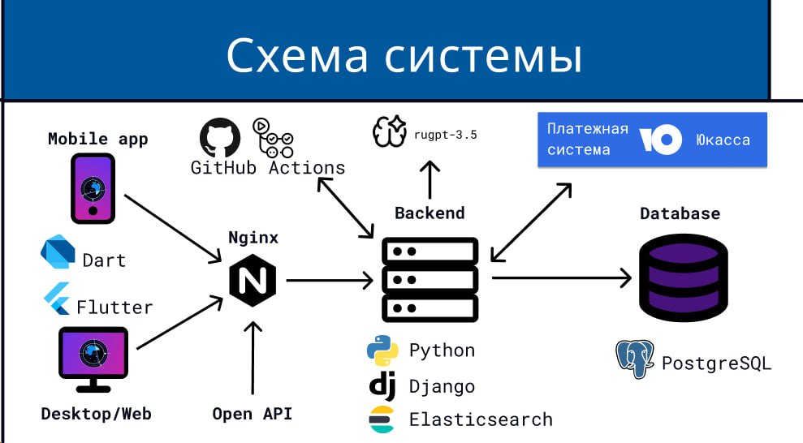
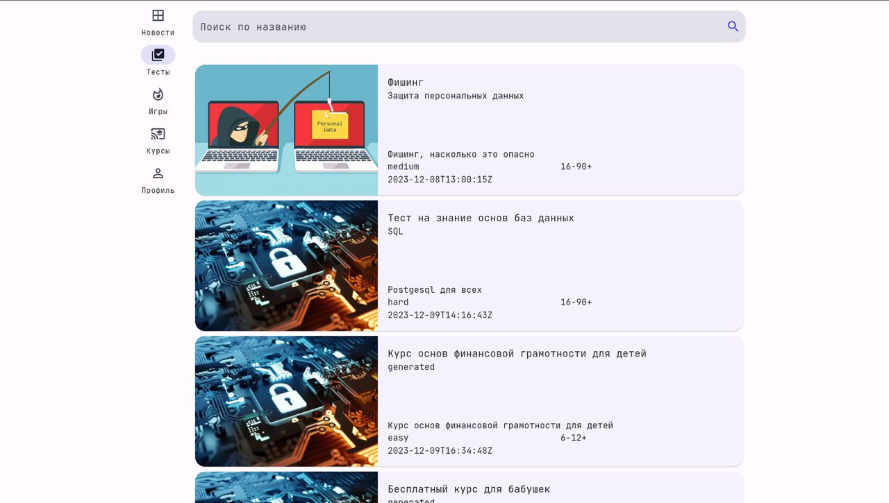

# Cyber world платформа по информационной безопасности
## Воронежская область

## Архитектура предлагаемоего решения:

Использован фреймворк Django. Модульная архитектура с интеграцией с внешними API. Следовали принципами MVT, 
но также старались добавлять сервисы для вынесения бизнес логики приложения. Переменные окружения и другие чувствительные данные 
держали в github secrets и грузили, как переменные окружения. 
В качестве админки была модифицирована стандартная Django админка с дополнительными плагинами. Базы данных PostgresSGL, ElasticSearch.

Реализовано:

1) Создание тестов с выбором ответов, с обычным текстовым полем
2) Разделение пользователей на возрастные группы, по уровню знаний. Персонализация настроек в профиле пользователя
3) Создание курсов с добавлением цены на каждый из них
4) Создание заказов, история заказов.
5) Генерация сертификата об успешном прохождении курса
6) Интеграция с ЮKassa. Оплата по карте.
7) Баннеры, витрина, статический контент
8) Авторизация по почте и временному коду
9) Интеграция с Flexmonster для постороения графиков и диаграмм
10) Административная панель с моделями для управления
11) Автоматическая генерация тестов по описанию через API RuGPT
12) Развернут ElasticSearch для умного поиска для тестов и по базе знаний
13) Предложен алгоритм пользовательских рекомендаций статей из базы, на основании совершённых им ошибок в тесте.
14) Разделение пользователей по уровням, возможность смотреть статистику по самым лушим пользователям

## Ссылка на apk:

https://drive.google.com/file/d/1L6ZKmpBc0OFaog6C5ezC2YUSob-BnInL/view?usp=sharing

## Админка доступна по адресу:

https://cybertest.fbtw.ru/admin/

Логин: admin
Пароль: ks

## Swagger доступен по адресу:

https://cybertest.fbtw.ru/api/

## Архитектура клиентского приложения:

## Для пользователей реализовано мобильное приложение на Flutter
1) Кроссплатформенность: IOS, Android
2) Карта с отображением движения спутников
3) Интеграция с Firebase Crashlytics для мониторинга ошибок приложения
4) MWWM (Elementary framework)

Ссылка на apk:

## Скрин Web приложения:

